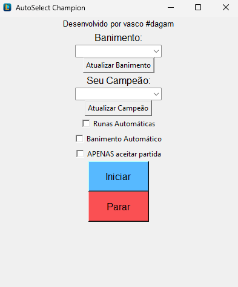

# **AutoChampion Select - League of Legends (PT-BR)**

### **Descrição**
Este projeto é uma aplicação desenvolvida em Python que realiza **a seleção automática do seu campeão, runa e banimento em League of Legends**, fiz uma aplicação utilizando opencv, e uma interface simples. A ideia é para evitar perder filas e atrapalhar os jogos de outras pessoas. É possível selecionar qualquer campeão para banimento e qualquer campeão para jogar.
O executável possui cerca de 100MB, mas pretendo otimizar essa questão. O código é **OPEN SOURCE**, qualquer sugestão ou modificação podem ser solicitadas. Meus contatos estarão disponíveis ao final desse README.

### **Possíveis problemas**
- Caso o campeão que você queira jogar esteja **BANIDO**, o AutoChampion **NÃO** selecionará o campeão que você escolheu.
- A runa selecionada automaticamente por nós selecionará a runa **DO MEIO**, mas você pode desabilitar essa opção e deixar para o League of Legends escolher a sua runa ou outros aplicativos, como o Mobalitics.
- Para instalar, siga os passos abaixos para não ocorrer nenhum problema. Por enquanto, está diponível **APENAS** para Windows. Futuramente irei implementar um AutoChampion para Valorant.
  
---

### **Como baixar**
**Para rodar este projeto, você precisa:**
- **Clonar** esse repositório
- Clicar duas vezes (como se estivesse abrindo o Google ou executando um arquivo) no arquivo "install.bat"
- O arquivo de instalação instalará Python (caso você não o possua), bibliotecas simples e criará o executável para rodar AutoChampion
- O executável "AutoChampion.exe" estará numa pasta chamada "dist"
- Basta executar o AutoChampion.exe
- Bibliotecas Python necessárias: Numpy, OpenCV, PyAutoGUI (estão disponíveis nos requirements.txt)

---
  
### **Como utilizar o AutoChampion**

    

